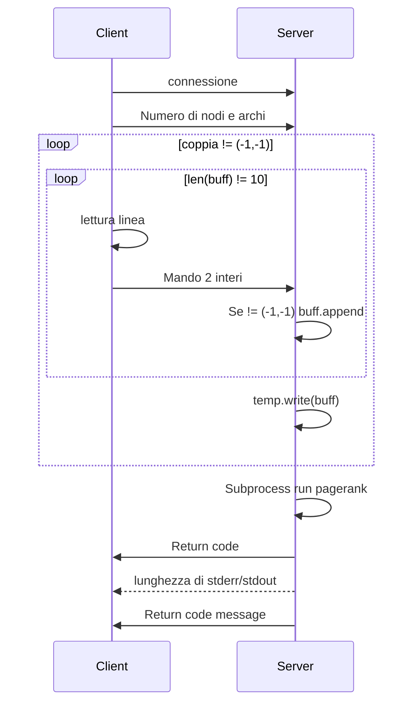

# Web Ranking
Il progetto è suddiviso su due cartelle: una cartella `error/` che contiene tutti i file riguardanti la gestione degli errori, e una cartella `core/` contenente tutto ciò che riguarda l'algoritmo, quindi la creazione del grafo che avviene nel file `graph.c`, e il calcolo del pagerank che avviene nel file `calc.c`. In questi file ci sono le funzioni che sucessivamente saranno chiamati nel `main.c` per il la creazione, il calcolo e in fine la liberazione della memoria.
## Creazione grafo - *graph.c*
La funzione che viene chiamata nel main per la creazione del grafo è
```C
graph *graph_init(const int threads, FILE *infile)
```
che restituisce il grafo popolato con i valori letti da `infile`.
### Produttore
Per la **popolazione** del grafo vengono creati dei threads il cui numero è ricevuto come parametro della funzione, il passaggio dei dati avviene attraverso un buffer sfruttando quindi lo schema produttore/consumatore.  
Il **main** thread ricopre il ruolo di  **produttore** leggendo i valori dal file `infile` e aggiungendoli a una `struct pair` contenente le coppie ordinate che verranno aggiunte al buffer.  
La <u>concorrenza</u> è gestita attraverso due condition variable "legate" a una mutex
```C
pthread_cond_t free_slots;
pthread_cond_t busy_slots;
pthread_mutex_t mutex;
```
utili a tenere traccia degli slot liberi e occupati del buffer. Una volta terminata la lettura dei valori dal file, il produttore (*main thread*) manda tanti valori di terminazione (-1), tanti quanti sono i thread che sono stati creati.
### Consumatori
I <u>Consumatori</u> stanno in wait su `busy_slots` in attesa che siano dei valori nel buffer; se ci sono acquisiscono la mutex, salvano la coppia, rilasciano la mutex e fanno la signal su `free_slots`. Fatto ciò si occupano adesso dell aggiunta al grafo, e per evitare race condition con gli altri thread, per la modifica dei valori del grafo
viene utilizzata una ulteriore mutex chiamata `g_mutex`.

## Calcolo del pagerank - *calc.c*
Il calcolo del pagerank sfrutta lo stesso numero di thread utilizzati per la creazione del grafo, all'inizio della funzione viene creato un thread apposito per la gestione del segnale `SIGUSR1` e per terminare il thread handler ho fatto in modo che venga catturato anche `SIGUSR2`, e alla ricezione di quest'ultimo il thread gestore termina e viene reimpostata la gestione dei segnali di default.  
In seguito vengono create le strutture dati (array, indici, contatori etc...) e i thread che dovranno svolgere l'effettivo calcolo.  
La gestione della <u>concorrenza</u> è stata gestita attraverso **condition variables**, visto che i valori da passare ai thread ausiliari ("consumatori") erano interi da 0 a N-1.  
Per poter parallelizzare il calcolo di S<sub>t</sub><sup>t+1</sup> e Y<sup>t+1</sup> *(il sucessivo contributo dei nodi DE e la successiva i-esima componente del vettore Y)*, vengono create e passate ai thread delle variabili temporanee : `double tempDE` e il vettore `double *tempY`, che inizialmente all iterazione 0 vengono popolate dal main thread, e dalla prima iterazione sono interamente calcolate dai thread ausiliari.
```C
pthread_mutex_t mutex;
pthread_cond_t can_update;
pthread_cond_t lib;
```
### Produttore
Il thread **produttore**(*main*) si mette in attesa sulla condition variable `can_update` e testa la variabile `endedt`.  
La variabile `endedt` conta i thread che hanno effettivamente terminato la computazione dell' i-esima componente del vettore, mentre un altra variabile(`index`) sarà effettivamente consumata dai thread e subito rilasciata.  
Una volta uscito dalla condizione dalla condizione il produttore:
<ol>
<li>Azzera la variabile index</li>
<li>Azzera la variabile endedt</li>
<li>Assegna a dead_end il valore tempDE</li>
<li>Copia il vettore NEXT in X</li>
<li>Copia il vettore tempY in Y</li>
<li>Incrementa il contatore delle iterazioni</li>
</ol>  

Infine viene fatta la broadcast ai thread in attesa su `lib`.
Tutto ciò avviene in un ciclo while controllando il numero di iterazioni passato come argomento nella chiamata e a ogni iterazione verifico che l'errore calcolato dai thread ausiliari diventi minore di quello passato negli argomenti, in caso tal caso esco dal ciclo.
Terminate le iterazioni passo i valori di terminazione ai thread ausiliari e termino il programma.  
### Consumatori
I thread consumatori si mettono in attesa sulla *cond. var.* `lib`, una volta superata la condizione salvano il valore di `index` in `ind`,incrementano l'`index` e rilasciano la mutex. Fatto ciò possono calcolare i valori della componente `NEXT[index]` *(alla prima iterazione i valori di Y e del contributo nodi dead_end vengono calcolati dal main insieme a X)* senza la mutex. Una volta calcolata la componente del vettore `NEXT[ind]`, si riacquisice la mutex e si possono calcolare l'errore, la componente `[ind]` del futuro vettore `Y`, e incrementare il futuro dead_end, che a fine iterazione verranno scambiati dal main thread.  
Una volta terminato il calcolo incremento la variabile che tiene traccia dei thread che hanno effettivamente terminato il calcolo(`endedt`), se `endedt==N` significa che il thread in questione è l ultimo della corrente iterazione e deve provvedere a moltiplicare:  
 $`tempS_t = tempS_t * d/N `$ ; si fa la signal a `can_update` e si rilascia la mutex.

 ## Client e Server - *py*
 Sia per il client che per il server in python vengono creati dei thread con un pool di thread
 ```Python
with concurrent.futures.ThreadPoolExecutor() as exe:
```
### Server
Nel file *graph_server.py* per ogni connessione in arrivo viene fatta la `exe.submit(conn_handling, conn,addr)`. Il blocco di codice del socket nella quale si attendono le connessioni è all interno di un blocco `try` in modo da poter catturare `SIGINT`, una volta ricevuto il segnale viene fatta chiamato `exe.shutdown(wait= True)` che consente di attendere che tutti i thread in esecuzione abbiano terminato , infine stampa `Bye dal server`.
### Client  
Il client nel file `graph_client.py` , per ogni file passato come argomento fa `exe.submit(thread_job,file)`, e fa partire il thread_job che si connette al server.
I primi valori mandati sono il numero di nodi e il numero di archi, dopodiche in loop finche non termino il file mando in sequenza il valore 2(numero valori) e la coppia di valori, quando termina il file mando -1 (fa uscire il server dal ciclo di lettura). Infine attenderò l'exit code, la lunghezza della stringa `stderr/stdin`, e la stringa `stdin/stderr`.

### Esempio scambio dati


<br>
<br>


